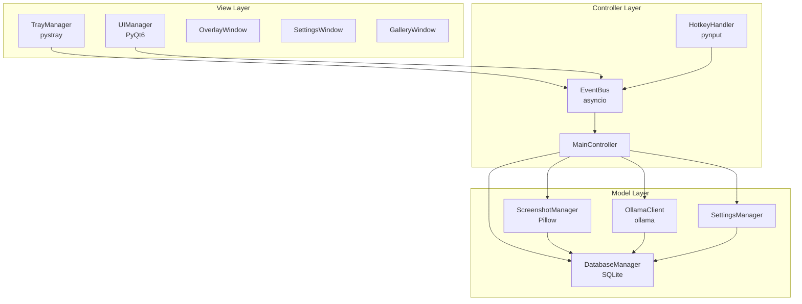

# Project Architecture: Explain Screenshot Application

## Overview

This document outlines the architecture for a lightweight, cross-platform desktop application built with Python 3.12 following the MVC pattern. The application operates as a background process with system tray integration, featuring a dark-themed UI with minimal transparency, SQLite data storage, and Ollama AI integration.

## Architecture Diagram



## Data Flow Diagram

```
User Action → HotkeyHandler → EventBus → MainController → Model → Database/Ollama
     ↓                                         ↓
System Tray ← UIManager ← EventBus ← Response Processing
```

## Module Specifications

### 1. TrayManager (View Layer)

**Responsibilities:**
- System tray icon lifecycle management
- Context menu creation and handling
- Application start/stop coordination
- Window focus management

**Public Interface:**
```
Methods:
- initialize() -> None
- create_menu() -> None
- show_settings() -> None
- quit_application() -> None
- update_icon(status: str) -> None

Events Emitted:
- "tray.settings_requested"
- "tray.quit_requested"
- "tray.show_overlay"
```

**Dependencies:**
- pystray for system tray functionality
- EventBus for communication

**Error Handling:**
- Graceful fallback if system tray is unavailable
- Icon loading failure recovery
- Menu creation error handling

### 2. HotkeyHandler (Controller Layer)

**Responsibilities:**
- Global hotkey registration and monitoring
- Input event processing
- Hotkey conflict detection and resolution

**Public Interface:**
```
Methods:
- register_hotkeys(config: dict) -> bool
- unregister_hotkeys() -> None
- is_hotkey_available(combination: str) -> bool

Events Emitted:
- "hotkey.screenshot_capture"
- "hotkey.overlay_toggle"
- "hotkey.settings_open"
```

**Dependencies:**
- pynput for global hotkey monitoring
- EventBus for event emission

**Error Handling:**
- Hotkey registration failure handling
- Permission denied scenarios
- Conflicting hotkey detection

### 3. ScreenshotManager (Model Layer)

**Responsibilities:**
- Screenshot capture across multiple monitors
- Image processing and optimization
- File system operations for screenshot storage
- Thumbnail generation for gallery view

**Public Interface:**
```
Methods:
- capture_screenshot(region: Optional[tuple] = None) -> Screenshot
- get_recent_screenshots(limit: int = 10) -> List[Screenshot]
- generate_thumbnail(image_path: str, size: tuple) -> bytes
- cleanup_old_screenshots(days: int) -> int

Data Structures:
Screenshot:
- id: str
- filename: str
- path: str
- timestamp: datetime
- thumbnail_path: str
- file_size: int
```

**Dependencies:**
- Pillow for image processing
- DatabaseManager for metadata storage

**Error Handling:**
- Screen capture permission issues
- Disk space management
- File system access errors
- Image processing failures

### 4. DatabaseManager (Model Layer)

**Responsibilities:**
- SQLite database connection management
- CRUD operations for all entities
- Database schema migrations
- Connection pooling and transaction management

**Public Interface:**
```
Async Methods:
- initialize_database() -> None
- create_screenshot(screenshot: Screenshot) -> int
- get_screenshots(limit: int, offset: int) -> List[Screenshot]
- create_chat_entry(chat: ChatEntry) -> int
- get_chat_history(screenshot_id: int) -> List[ChatEntry]
- create_preset(preset: Preset) -> int
- get_presets() -> List[Preset]
- cleanup_database() -> None
```

**Database Schema:**
```sql
-- Screenshots table
CREATE TABLE screenshots (
    id INTEGER PRIMARY KEY AUTOINCREMENT,
    filename TEXT NOT NULL,
    path TEXT NOT NULL UNIQUE,
    timestamp DATETIME DEFAULT CURRENT_TIMESTAMP,
    file_size INTEGER,
    thumbnail_path TEXT,
    metadata TEXT -- JSON for extensibility
);

-- Chat history table
CREATE TABLE chat_history (
    id INTEGER PRIMARY KEY AUTOINCREMENT,
    screenshot_id INTEGER,
    prompt TEXT NOT NULL,
    response TEXT,
    timestamp DATETIME DEFAULT CURRENT_TIMESTAMP,
    model_name TEXT,
    processing_time REAL,
    FOREIGN KEY (screenshot_id) REFERENCES screenshots(id) ON DELETE CASCADE
);

-- Presets table
CREATE TABLE presets (
    id INTEGER PRIMARY KEY AUTOINCREMENT,
    preset_name TEXT NOT NULL UNIQUE,
    prompt_text TEXT NOT NULL,
    description TEXT,
    created_at DATETIME DEFAULT CURRENT_TIMESTAMP,
    usage_count INTEGER DEFAULT 0
);

-- Settings table
CREATE TABLE settings (
    key TEXT PRIMARY KEY,
    value TEXT NOT NULL,
    type TEXT DEFAULT 'string',
    updated_at DATETIME DEFAULT CURRENT_TIMESTAMP
);
```

**Error Handling:**
- Database corruption recovery
- Connection timeout handling
- Transaction rollback mechanisms
- Migration failure recovery

### 5. OllamaClient (Model Layer)

**Responsibilities:**
- Ollama server communication
- Image encoding and transmission
- Response parsing and validation
- Connection state management

**Public Interface:**
```
Async Methods:
- check_connection() -> bool
- get_available_models() -> List[str]
- send_prompt(image_path: str, prompt: str, model: str) -> Response
- send_chat_message(conversation_id: str, message: str) -> Response
- get_model_info(model_name: str) -> ModelInfo

Data Structures:
Response:
- content: str
- model: str
- processing_time: float
- success: bool
- error_message: Optional[str]
```

**Dependencies:**
- ollama library for API communication
- DatabaseManager for response logging

**Error Handling:**
- Offline mode fallback
- Connection timeout management
- Model unavailability handling
- Rate limiting compliance
- Large image handling

### 6. SettingsManager (Model Layer)

**Responsibilities:**
- Application configuration management
- Settings validation and defaults
- Configuration file operations
- Runtime settings updates

**Public Interface:**
```
Methods:
- load_settings() -> Settings
- save_settings(settings: Settings) -> bool
- get_setting(key: str, default: Any) -> Any
- update_setting(key: str, value: Any) -> bool
- reset_to_defaults() -> None
- export_settings() -> dict
- import_settings(data: dict) -> bool

Settings Structure:
- hotkeys: dict
- screenshot_directory: str
- ollama_model: str
- ui_theme: str
- auto_cleanup_days: int
- thumbnail_quality: int
```

**Dependencies:**
- DatabaseManager for persistent storage

**Error Handling:**
- Invalid configuration recovery
- File permission issues
- Setting validation failures
- Migration from older versions

### 7. UIManager (View Layer)

**Responsibilities:**
- PyQt6 application lifecycle
- Window management and coordination
- Theme application and consistency
- UI component factory and registry

**Public Interface:**
```
Methods:
- initialize_application() -> QApplication
- create_overlay_window() -> OverlayWindow
- create_settings_window() -> SettingsWindow
- create_gallery_window() -> GalleryWindow
- apply_theme(theme: str) -> None
- show_notification(message: str, type: str) -> None

Windows:
OverlayWindow:
- Recent screenshots grid
- Quick actions menu
- Auto-hide on focus loss

SettingsWindow:
- Configuration panels
- Hotkey assignment
- Directory selection
- Model configuration

GalleryWindow:
- Three-column layout
- Thumbnail browser
- Chat interface
- Preset management
```

**Dependencies:**
- PyQt6 for UI framework
- EventBus for communication

**Error Handling:**
- Widget creation failures
- Theme loading errors
- Window positioning issues
- Memory management for large galleries

### 8. EventBus (Controller Layer)

**Responsibilities:**
- Asynchronous event distribution
- Publisher-subscriber pattern implementation
- Event queuing and prioritization
- Cross-module communication facilitation

**Public Interface:**
```
Async Methods:
- subscribe(event_type: str, handler: Callable) -> str
- unsubscribe(subscription_id: str) -> bool
- emit(event_type: str, data: Any) -> None
- emit_and_wait(event_type: str, data: Any) -> List[Any]

Event Types:
- "screenshot.captured"
- "ui.overlay.show"
- "ui.overlay.hide"
- "settings.updated"
- "ollama.response.received"
- "error.occurred"
```

**Dependencies:**
- asyncio for async operations

**Error Handling:**
- Handler exception isolation
- Event delivery failure recovery
- Queue overflow management
- Circular dependency detection

### 9. MainController (Controller Layer)

**Responsibilities:**
- Application orchestration
- Event coordination between layers
- Business logic implementation
- State management

**Public Interface:**
```
Async Methods:
- initialize() -> None
- handle_screenshot_request() -> None
- handle_overlay_request() -> None
- handle_settings_update(settings: dict) -> None
- handle_ai_request(image_path: str, prompt: str) -> None
- shutdown() -> None
```

**Dependencies:**
- All Model layer components
- EventBus for coordination

**Error Handling:**
- Centralized error logging
- Recovery mechanisms
- User notification system
- Graceful degradation

## Asyncio Integration with PyQt6

### Event Loop Management

The application uses a custom event loop integration to combine asyncio with PyQt6:

1. **Main Thread Management:**
   - PyQt6 QApplication runs on the main thread
   - Asyncio event loop runs in the same thread using QEventLoop integration
   - Custom QTimer-based event loop runner for seamless integration

2. **Async Operation Handling:**
   - Database operations wrapped in async functions
   - Ollama API calls handled asynchronously
   - Image processing operations use thread pools for CPU-intensive tasks

3. **UI Responsiveness:**
   - Long-running operations delegated to worker threads
   - Progress indicators for AI processing
   - Non-blocking UI updates via signal-slot mechanism

### Implementation Strategy

```
QApplication.exec() → Custom Event Loop → asyncio.run_until_complete()
                                      ↓
                               Background Tasks:
                               - Database operations
                               - Ollama API calls
                               - File I/O operations
```

## Error Handling Architecture

### Centralized Error Management

1. **Error Classification:**
   - Critical: Application-stopping errors
   - Warning: Degraded functionality
   - Info: User notifications

2. **Error Flow:**
   ```
   Error Occurrence → Module Handler → EventBus → MainController → Logger + UI Notification
   ```

3. **Recovery Mechanisms:**
   - Automatic retry for transient failures
   - Fallback modes for service unavailability
   - Graceful degradation strategies

### Logging Strategy

- **File-based logging** with rotation
- **Structured logging** with JSON format
- **Performance metrics** collection
- **User privacy** protection in logs

## Performance Considerations

### Memory Management

1. **Image Handling:**
   - Lazy loading of thumbnails
   - Automatic image compression
   - Memory-mapped file access for large images
   - LRU cache for frequently accessed images

2. **Database Optimization:**
   - Connection pooling
   - Prepared statements
   - Index optimization
   - Periodic vacuum operations

3. **UI Performance:**
   - Virtual scrolling for large galleries
   - Asynchronous thumbnail generation
   - Background data prefetching
   - Efficient widget recycling

### Resource Optimization

- **Startup Time:** Lazy module initialization
- **CPU Usage:** Background processing prioritization
- **Disk Space:** Automatic cleanup policies
- **Network:** Request batching and caching

## Extensibility Points

### 1. Plugin Architecture
- **Event-driven plugins** via EventBus
- **UI component registration** system
- **Custom preset types** support

### 2. AI Model Integration
- **Abstract AI client interface** for multiple providers
- **Model capability detection** and adaptation
- **Custom prompt templates** system

### 3. Screenshot Enhancement
- **OCR integration** for text extraction
- **Image annotation** capabilities
- **Batch processing** operations

### 4. Export and Integration
- **Multiple export formats** (PDF, Word, etc.)
- **Cloud storage integration** (Google Drive, Dropbox)
- **API endpoints** for external applications

## Security Considerations

### Data Protection
- **Local-only processing** by default
- **Encrypted settings storage** for sensitive data
- **Secure file permissions** for screenshot directory
- **Input validation** for all user inputs

### Privacy
- **No telemetry** collection
- **Local AI processing** emphasis
- **User consent** for any external communications
- **Data retention policies** configuration

## Deployment Architecture

### Distribution Strategy
- **Single executable** using PyInstaller
- **Minimal dependencies** bundling
- **Auto-update mechanism** (optional)
- **Portable installation** support

### Platform Considerations
- **Windows 10/11** primary target
- **macOS and Linux** compatibility layers
- **Architecture detection** (x64, ARM64)
- **System integration** hooks

This architecture provides a solid foundation for a maintainable, extensible, and performant screenshot explanation application while adhering to the MVC pattern and minimizing coupling between components.
