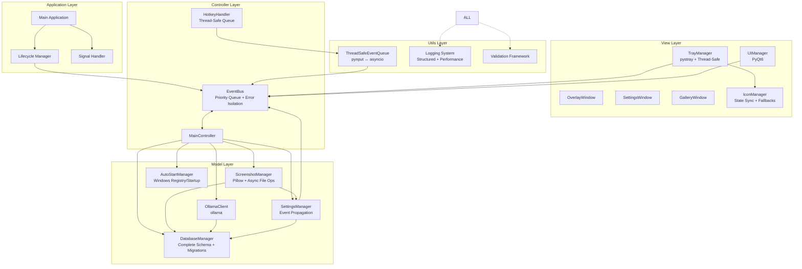

# Project Architecture: ExplainShot Application

## Overview

This document outlines the architecture for a lightweight, cross-platform desktop application built with Python 3.12 following the MVC pattern. The application operates as a background process with system tray integration, featuring a dark-themed UI with minimal transparency, SQLite data storage, and Ollama AI integration.

## Architecture Diagram



## Data Flow Diagram

```
User Action → HotkeyHandler → ThreadSafeEventQueue → EventBus → MainController
     ↓                                                              ↓
System Tray ← TrayManager ← EventBus ← SettingsManager ← ScreenshotManager → Database
     ↓                         ↑
UI Updates ← IconManager ← Settings Changes
```

### Event Flow
1. **Hotkey Detection**: Global hotkey captured by pynput in separate thread
2. **Thread-Safe Queuing**: ThreadSafeEventQueue bridges pynput thread to asyncio loop
3. **Event Processing**: EventBus handles events with priority queuing and error isolation
4. **Business Logic**: MainController coordinates screenshot capture and processing
5. **Data Persistence**: ScreenshotManager saves files and metadata to database
6. **Settings Propagation**: SettingsManager emits changes through EventBus
7. **UI Updates**: TrayManager and IconManager receive updates via EventBus

## Module Specifications

### 1. TrayManager (View Layer)

**Responsibilities:**
- System tray icon lifecycle management with thread-safe
- Context menu creation and handling
- Application start/stop coordination
- Dynamic icon state management

**Public Interface:**
```python
class TrayManager:
    async def initialize() -> None
    def create_menu() -> None
    async def show_settings() -> None
    async def quit_application() -> None
    async def update_icon(status: str) -> None
    def run() -> None  # Runs in separate thread

Events Emitted:
- "tray.settings_requested"
- "tray.quit_requested"
- "tray.show_overlay"
- "tray.initialized"

Events Handled:
- "settings.changed"
- "app.status_changed"
```

**Implementation Status:**
- ✅ Thread-safe icon updates
- ✅ EventBus integration
- ✅ Context menu handling
- ✅ Graceful shutdown coordination

### 2. HotkeyHandler (Controller Layer)

**Responsibilities:**
- Global hotkey registration and monitoring with thread-safe event processing
- Cross-thread communication between pynput and asyncio
- Event queuing and processing coordination

**Public Interface:**
```python
class HotkeyHandler:
    async def initialize() -> None
    async def register_hotkey(combo: str, event_name: str) -> None
    async def unregister_hotkey(combo: str) -> None
    async def start_monitoring() -> None
    async def stop_monitoring() -> None

class ThreadSafeEventQueue:
    def put_event(event: HotkeyEvent) -> None
    async def process_events() -> None
    def set_loop(loop: asyncio.AbstractEventLoop) -> None

Events Emitted:
- "hotkey.screenshot_area"
- "hotkey.screenshot_full"
- "hotkey.show_overlay"
```

**Implementation Status:**
- ✅ ThreadSafeEventQueue for pynput ↔ asyncio coordination
- ✅ Weakref-based event loop management
- ✅ Async event processing pipeline
- ✅ Error handling and graceful shutdown

### 3. ScreenshotManager (Model Layer) ✅ Fully Implemented

**Responsibilities:**
- Screenshot capture across multiple monitors with Pillow integration
- Atomic file operations with metadata handling
- Database integration for screenshot metadata
- Real screenshot capture integrated in application flow

**Public Interface:**
```python
class ScreenshotManager:
    async def capture_screenshot(region: Optional[tuple] = None) -> Screenshot
    async def save_screenshot(image: PIL.Image, filename: str) -> Screenshot
    async def get_recent_screenshots(limit: int = 10) -> List[Screenshot]
    async def delete_screenshot(screenshot_id: str) -> bool
    async def cleanup_old_screenshots(days: int) -> int

@dataclass
class Screenshot:
    id: str
    filename: str
    file_path: str
    timestamp: datetime
    width: int
    height: int
    file_size: int
```

**Implementation Status:**
- ✅ PIL/Pillow integration for screen capture
- ✅ Atomic file save operations
- ✅ Database metadata registration
- ✅ Real screenshot capture in MainController handlers
- ✅ Async file operations with proper error handling

### 4. SettingsManager (Model Layer)

**Responsibilities:**
- Application configuration management with event propagation
- Database persistence of settings
- Automatic change notifications through EventBus
- Settings validation and type safety

**Public Interface:**
```python
class SettingsManager:
    async def load_settings() -> ApplicationSettings
    async def save_settings(settings: ApplicationSettings) -> None
    async def get_setting(key: str) -> Any
    async def update_setting(key: str, value: Any) -> None
    async def reset_to_defaults() -> None

@dataclass
class ApplicationSettings:
    hotkeys: HotkeySettings
    capture: CaptureSettings
    storage: StorageSettings
    ui: UISettings

Events Emitted:
- "settings.changed"
- "settings.hotkey_updated"
- "settings.capture_updated"
```

**Implementation Status:**
- ✅ EventBus integration for change propagation
- ✅ Async database operations
- ✅ Type-safe settings with dataclasses
- ✅ Automatic change notifications to all components

### 5. DatabaseManager (Model Layer)

**Responsibilities:**
- SQLite database connection management with complete schema
- CRUD operations for all entities with async support
- Database schema migrations and version management
- Transaction management and connection pooling

**Public Interface:**
```python
class DatabaseManager:
    async def initialize() -> None
    async def create_screenshot(screenshot: Screenshot) -> int
    async def get_screenshots(limit: int, offset: int) -> List[Screenshot]
    async def get_screenshot_by_id(screenshot_id: int) -> Optional[Screenshot]
    async def delete_screenshot(screenshot_id: int) -> bool
    async def create_chat_entry(entry: ChatEntry) -> int
    async def get_chat_history(screenshot_id: int) -> List[ChatEntry]
    async def create_preset(preset: Preset) -> int
    async def get_presets() -> List[Preset]
    async def save_settings(settings: dict) -> None
    async def get_settings() -> dict

Database Schema:
- screenshots: Complete metadata storage
- chat_entries: AI conversation history
- presets: User-defined prompt presets
- settings: Application configuration
- migrations: Schema version tracking
```

**Implementation Status:**
- ✅ Complete database schema with all tables
- ✅ Migration framework for schema updates
- ✅ Async database operations
- ✅ Integration with ScreenshotManager and SettingsManager

### 6. MainController (Controller Layer)

**Responsibilities:**
- Central orchestration of all application components
- Business logic coordination with component integration
- Lifecycle management and error handling
- Real screenshot integration and processing

**Public Interface:**
```python
class MainController:
    async def initialize() -> None
    async def start() -> None
    async def stop() -> None
    async def handle_screenshot_request(event_data: dict) -> None
    async def handle_settings_change(event_data: dict) -> None
    async def cleanup() -> None

Component Integration:
- DatabaseManager: Data persistence
- SettingsManager: Configuration management
- ScreenshotManager: Screenshot operations
- EventBus: Event coordination
```

**Implementation Status:**
- ✅ All component integrations implemented
- ✅ Real screenshot capture in event handlers
- ✅ Proper dependency injection and initialization
- ✅ Error handling and logging

### 7. EventBus (Controller Layer)

**Responsibilities:**
- Event-driven communication between all components
- Priority-based event processing and error isolation
- Async event handling with proper cleanup
- Thread-safe operations across component boundaries

**Public Interface:**
```python
class EventBus:
    async def emit(event: str, data: Any = None, priority: int = 0) -> None
    def subscribe(event: str, handler: Callable, priority: int = 0) -> None
    def unsubscribe(event: str, handler: Callable) -> None
    async def start() -> None
    async def stop() -> None
    async def process_events() -> None

Event Flow:
- Priority-based processing (higher priority first)
- Error isolation (one handler failure doesn't affect others)
- Async handler support with proper awaiting
- Weakref-based cleanup for memory management
```

**Implementation Status:**
- ✅ Priority queue for event processing
- ✅ Error isolation between handlers
- ✅ Async event processing loop
- ✅ Thread-safe event emission and subscription

### 8. AutoStartManager (Model Layer)

**Responsibilities:**
- Windows startup integration via registry
- Auto-start configuration and validation
- Cross-platform startup handling (Windows focus)
- Startup state management

**Public Interface:**
```python
class AutoStartManager:
    async def enable_auto_start() -> bool
    async def disable_auto_start() -> bool
    async def is_auto_start_enabled() -> bool
    async def validate_auto_start() -> bool

Windows Implementation:
- Registry key: HKEY_CURRENT_USER\Software\Microsoft\Windows\CurrentVersion\Run
- Application name: "ExplainShot"
- Executable path validation
```

**Implementation Status:**
- ✅ Windows registry integration
- ✅ Auto-start enable/disable functionality
- ✅ Startup validation and error handling
- ✅ Integration with SettingsManager for persistence

**Public Interface:**
```
Async Methods:
- check_connection() -> bool
- get_available_models() -> List[str]
- send_prompt(image_path: str, prompt: str, model: str) -> Response
- send_chat_message(conversation_id: str, message: str) -> Response
- get_model_info(model_name: str) -> ModelInfo

Data Structures:
Response:
- content: str
- model: str
- processing_time: float
- success: bool
- error_message: Optional[str]
```

**Dependencies:**
- ollama library for API communication
- DatabaseManager for response logging

**Error Handling:**
- Offline mode fallback
## Event System Patterns

### Thread-Safe Event Processing
```python
# HotkeyHandler → ThreadSafeEventQueue → EventBus
class ThreadSafeEventQueue:
    def __init__(self):
        self._queue = asyncio.Queue()
        self._loop_ref = None

    def put_event(self, event: HotkeyEvent):
        """Called from pynput thread"""
        if self._loop_ref and (loop := self._loop_ref()):
            loop.call_soon_threadsafe(self._queue.put_nowait, event)

    async def process_events(self):
        """Called from asyncio loop"""
        while True:
            event = await self._queue.get()
            await self.event_bus.emit(event.name, event.data)
```

### Settings Change Propagation
```python
# SettingsManager → EventBus → All Components
class SettingsManager:
    async def update_setting(self, key: str, value: Any):
        await self.database.save_setting(key, value)
        await self.event_bus.emit("settings.changed", {
            "key": key,
            "value": value,
            "timestamp": datetime.now()
        })

# Components automatically receive updates
class TrayManager:
    def __init__(self, event_bus):
        event_bus.subscribe("settings.changed", self.on_settings_changed)

    async def on_settings_changed(self, data):
        if data["key"] == "theme":
            await self.update_icon_theme(data["value"])
```

### Priority Event Processing
```python
# EventBus with priority handling
class EventBus:
    async def emit(self, event: str, data: Any = None, priority: int = 0):
        event_item = PriorityEventItem(priority, event, data)
        await self._event_queue.put(event_item)

    async def process_events(self):
        while True:
            item = await self._event_queue.get()
            # Higher priority (lower number) processed first
            await self._handle_event(item.event, item.data)
```

## Technology Stack

### Core Dependencies
- **Python 3.12**: Latest LTS with modern async/await support
- **asyncio**: Event loop and async coordination
- **SQLite**: Local database with async wrapper (aiosqlite)
- **PIL/Pillow**: Screenshot capture and image processing
- **pynput**: Global hotkey detection and input monitoring
- **pystray**: System tray integration

### Future Dependencies (Planned)
- **PyQt6**: Modern GUI framework for settings and gallery interfaces
- **ollama**: Local AI model integration for screenshot analysis
- **aiohttp**: HTTP client for Ollama API communication

### Development Tools
- **pytest**: Testing framework with async support
- **black**: Code formatting
- **mypy**: Static type checking
- **logging**: Structured logging with performance metrics

## Performance Considerations

### Threading Model
- **Main Thread**: asyncio event loop with UI coordination (future)
- **Pynput Thread**: Global hotkey monitoring with thread-safe event queue
- **Tray Thread**: System tray operations isolated from main event loop
- **Background Tasks**: Screenshot processing, database operations, file I/O

### Memory Management
- **Weakref Usage**: Event loop references prevent memory leaks
- **Resource Cleanup**: Proper cleanup of PIL images, database connections
- **Event Queue Limits**: Bounded queues prevent memory exhaustion
- **Database Connection Pooling**: Efficient connection reuse

### Performance Optimizations
- **Async Database Operations**: Non-blocking database interactions
- **Priority Event Processing**: Critical events processed first
- **Lazy Loading**: Components initialized only when needed
- **Efficient Screenshot Capture**: PIL optimizations for large screen captures

## Error Handling Strategy

### Error Isolation
- **Component Isolation**: Errors in one component don't affect others
- **Event Handler Isolation**: Handler failures don't break event system
- **Thread Safety**: Proper exception handling across thread boundaries
- **Graceful Degradation**: System continues operating with reduced functionality

### Recovery Mechanisms
- **Database Recovery**: Automatic recovery from corruption or connection issues
- **Settings Recovery**: Fallback to defaults if configuration is corrupted
- **Hotkey Recovery**: Re-registration after system changes
- **File System Recovery**: Alternative paths if primary storage fails

### Logging and Monitoring
- **Structured Logging**: JSON-formatted logs with context
- **Performance Metrics**: Event processing times and system resource usage
- **Error Tracking**: Comprehensive error reporting with stack traces
- **User Feedback**: Non-intrusive error notifications through system tray
- Queue overflow management
- Circular dependency detection

### 9. MainController (Controller Layer)


The application uses a custom event loop integration to combine asyncio with PyQt6:

1. **Main Thread Management:**
   - Warning: Degraded functionality
   - Info: User notifications

2. **Error Flow:**
   ```
   Error Occurrence → Module Handler → EventBus → MainController → Logger + UI Notification
   ```

3. **Recovery Mechanisms:**
   - Automatic retry for transient failures
   - Fallback modes for service unavailability
   - Graceful degradation strategies

### Logging Strategy

- **File-based logging** with rotation
- **Structured logging** with JSON format
- **Performance metrics** collection
- **User privacy** protection in logs

## Performance Considerations

### Memory Management

1. **Image Handling:**
   - Lazy loading of thumbnails
   - Automatic image compression
   - Memory-mapped file access for large images
   - LRU cache for frequently accessed images

2. **Database Optimization:**
   - Connection pooling
   - Prepared statements
   - Index optimization
   - Periodic vacuum operations

3. **UI Performance:**
   - Virtual scrolling for large galleries
   - Asynchronous thumbnail generation
   - Background data prefetching
   - Efficient widget recycling

### Resource Optimization

- **Startup Time:** Lazy module initialization
- **CPU Usage:** Background processing prioritization
- **Disk Space:** Automatic cleanup policies
- **Network:** Request batching and caching

## Extensibility Points

### 1. Plugin Architecture
- **Event-driven plugins** via EventBus
- **UI component registration** system
- **Custom preset types** support

### 2. AI Model Integration
- **Abstract AI client interface** for multiple providers
- **Model capability detection** and adaptation
- **Custom prompt templates** system

### 3. Screenshot Enhancement
- **OCR integration** for text extraction
- **Image annotation** capabilities
- **Batch processing** operations

### 4. Export and Integration
- **Multiple export formats** (PDF, Word, etc.)
- **Cloud storage integration** (Google Drive, Dropbox)
- **API endpoints** for external applications

## Security Considerations

### Data Protection
- **Local-only processing** by default
- **Encrypted settings storage** for sensitive data
- **Secure file permissions** for screenshot directory
- **Input validation** for all user inputs

### Privacy
- **No telemetry** collection
- **Local AI processing** emphasis
- **User consent** for any external communications
- **Data retention policies** configuration

## Deployment Architecture

### Distribution Strategy
- **Single executable** using PyInstaller
- **Minimal dependencies** bundling
- **Auto-update mechanism** (optional)
- **Portable installation** support

### Platform Considerations
- **Windows 10/11** primary target
- **macOS and Linux** compatibility layers
- **Architecture detection** (x64, ARM64)
- **System integration** hooks

This architecture provides a solid foundation for a maintainable, extensible, and performant screenshot explanation application while adhering to the MVC pattern and minimizing coupling between components.
