# Step 3 Implementation Plan: Background Process and System Tray Development

## Overview

This document outlines the detailed implementation plan for Step 3 of the lightweight desktop application development, focusing on creating a robust background process with system tray integration. The implementation emphasizes minimal resource usage, seamless Windows integration, and adherence to the established MVC/EventBus architecture.

## Background Process Architecture

### Process Design Philosophy

The application operates as a **daemon-like background service** that:
- Launches silently without console windows
- Maintains minimal system footprint
- Provides persistent functionality across user sessions
- Handles graceful startup, operation, and shutdown cycles

### Main Entry Point Structure


### Process Lifecycle Management

**Startup Sequence:**
1. **Pre-initialization Phase:**
   - Validate single instance (prevent duplicate processes)
   - Configure logging with file rotation
   - Initialize asyncio event loop with custom policy
   - Set up signal handlers for graceful shutdown

2. **Core Initialization Phase:**
   - Async initialization of DatabaseManager
   - Load application settings via SettingsManager
   - Initialize EventBus and register core event handlers
   - Validate system dependencies (screen access, file permissions)

3. **Service Activation Phase:**
   - Launch TrayManager with icon and menu
   - Initialize HotkeyHandler (if enabled in settings)
   - Start background maintenance tasks
   - Emit `app.ready` event to signal full initialization

**Shutdown Sequence:**
1. **Signal Reception:**
   - Capture SIGTERM, SIGINT, or custom shutdown events
   - Emit `app.shutdown_requested` event via EventBus

2. **Graceful Cleanup:**
   - Unregister global hotkeys via HotkeyHandler
   - Close database connections in DatabaseManager
   - Remove system tray icon via TrayManager
   - Cancel background tasks and wait for completion

3. **Final Cleanup:**
   - Flush log buffers
   - Release system resources
   - Exit with appropriate status code

### PyInstaller Integration Considerations

**Executable Packaging Strategy:**
- **Single-file mode** for portable deployment
- **Windowed mode** to prevent console window visibility
- **Icon embedding** for professional appearance
- **Resource bundling** for tray icons and UI assets

**Runtime Environment Setup:**
- **Path resolution** for bundled resources using `sys._MEIPASS`
- **Temporary directory management** for extracted files
- **Library loading** optimization for faster startup
- **Error handling** for missing dependencies

## TrayManager Module Specification

### Core Responsibilities

The TrayManager serves as the primary user interface component for background operation:

**Primary Functions:**
- **Icon Lifecycle:** Create, update, and remove system tray icon
- **Menu Management:** Build and maintain context menu structure
- **Event Coordination:** Translate user interactions to EventBus events
- **Status Indication:** Provide visual feedback for application state

### Detailed Public Interface

```
Class: TrayManager

Async Methods:
- initialize_async() -> bool
  └─ Sets up tray icon and registers event listeners
- update_icon_state(state: IconState) -> None
  └─ Changes icon appearance based on application status
- show_notification(message: str, duration: int = 3000) -> None
  └─ Displays system notification via tray icon
- shutdown_async() -> None
  └─ Cleanup tray resources and unregister handlers

Synchronous Methods:
- build_menu() -> pystray.Menu
  └─ Constructs context menu with current settings
- handle_menu_action(action: str) -> None
  └─ Processes menu selections and emits events
- is_tray_available() -> bool
  └─ Checks system tray availability

Event Emissions:
- "tray.settings_requested" → Opens settings window
- "tray.gallery_requested" → Opens gallery window
- "tray.overlay_toggle" → Shows/hides overlay
- "tray.quit_requested" → Initiates application shutdown
- "tray.about_requested" → Shows about dialog

Configuration:
- icon_states: Dict[str, IconResource]
- menu_items: List[MenuItem]
- notification_settings: NotificationConfig
```

### Icon Management Strategy

**Icon State System:**
```
IconState Enumeration:
- IDLE: Default state, ready for operations
- CAPTURING: Currently taking screenshot
- PROCESSING: AI analysis in progress
- ERROR: System error or service unavailable
- DISABLED: Functionality temporarily disabled
```

**Visual Design Principles:**
- **Monochrome icons** for system theme compatibility
- **16x16 and 32x32 resolutions** for different DPI settings
- **Minimal detail** for clarity at small sizes
- **State indication** through icon variations or overlays

### Context Menu Architecture

**Menu Structure Design:**

```mermaid
graph TD
    A[Right-Click Tray Icon] --> B[Context Menu]
    B --> C[📸 Take Screenshot]
    B --> D[🖼️ Show Gallery]
    B --> E[⚙️ Settings]
    B --> F[❌ Exit]

    C --> G[Emit: screenshot.capture_requested]
    D --> H[Emit: gallery.show_requested]
    E --> I[Emit: settings.show_requested]
    F --> J[Emit: app.shutdown_requested]
```


**Menu Item Specifications:**
- **Take Screenshot:** Quick capture with default settings
- **Show Gallery:** Open gallery window with recent screenshots
- **Settings:** Open configuration window
- **Exit:** Graceful application shutdown

**Dynamic Menu Features:**
- **Conditional items** based on application state
- **Status indicators** showing current configuration
- **Submenu support** for future extensibility (e.g., preset shortcuts)

### Integration with EventBus

**Event Flow Architecture:**
```
User Interaction → TrayManager → EventBus → MainController → Model Operations
                                     ↓
System Tray Updates ← TrayManager ← EventBus ← Response Processing
```

**Event Handler Registration:**
```
Subscribed Events:
- "app.state_changed" → Update icon state
- "screenshot.completed" → Show success notification
- "error.occurred" → Display error notification
- "settings.changed" → Rebuild menu if needed

Emitted Events:
- "tray.menu_selected" → Menu action with payload
- "tray.notification_clicked" → User clicked notification
- "tray.icon_double_clicked" → Quick action trigger
```

## Auto-Start Implementation Strategy

### Windows Startup Integration

**Implementation Approaches:**

1. **Startup Folder Method (Primary):**
   ```
   Target Location: %APPDATA%\Microsoft\Windows\Start Menu\Programs\Startup
   Advantages:
   - No administrator privileges required
   - User-specific installation
   - Easy to remove manually
   - Transparent to user via Windows Settings

   Disadvantages:
   - User can easily disable
   - May be delayed by Windows fast startup
   ```

2. **Registry Method (Secondary):**
   ```
   Registry Key: HKEY_CURRENT_USER\Software\Microsoft\Windows\CurrentVersion\Run
   Advantages:
   - More persistent than startup folder
   - Faster startup execution
   - System-integrated management

   Disadvantages:
   - May trigger security warnings
   - Requires registry permissions
   - Less user-friendly removal
   ```

### Auto-Start Configuration Logic

**Decision Algorithm:**


**Configuration Management:**
```
Settings Integration:
- auto_start_enabled: boolean
- auto_start_method: "registry" | "startup_folder" | "auto"
- auto_start_delay: integer (seconds)
- auto_start_minimized: boolean

Methods:
- enable_auto_start() -> bool
- disable_auto_start() -> bool
- check_auto_start_status() -> AutoStartStatus
- update_auto_start_method(method: str) -> bool
```

### Permission Handling

**Privilege Escalation Strategy:**
- **Primary approach:** User-level integration without elevation
- **Fallback mechanism:** Request elevation only if explicitly chosen
- **Error handling:** Graceful degradation with user notification
- **Verification:** Test auto-start functionality after setup

## Workflow Diagrams

### Startup Workflow


### Menu Interaction Workflow


### Shutdown Workflow


## Error Handling Strategies

### Exception Classification and Handling

**Critical Errors (Application-terminating):**
```
Scenarios:
- System tray unavailable (rare)
- Permissions denied for essential operations
- Memory allocation failures
- Core dependency missing

Handling Strategy:
- Log error with full stack trace
- Display user-friendly error dialog
- Attempt graceful cleanup
- Exit with appropriate error code
```

**Recoverable Errors (Degraded functionality):**
```
Scenarios:
- Icon loading failure
- Menu creation error
- Auto-start configuration failure
- Notification display failure

Handling Strategy:
- Log warning with context
- Use fallback mechanisms
- Notify user via alternative means
- Continue operation with reduced features
```

**Transient Errors (Retry-eligible):**
```
Scenarios:
- Temporary file system issues
- Network connectivity problems
- Resource temporarily unavailable

Handling Strategy:
- Implement exponential backoff retry
- Log retry attempts
- Set maximum retry limits
- Fallback to degraded mode if retries exhausted
```

### Specific Error Scenarios

**TrayManager Error Handling:**
```
Exception Types:
- pystray.IconError: Icon creation/display failure
- OSError: System integration issues
- ImportError: Missing dependencies
- PermissionError: Access denied

Recovery Mechanisms:
- Icon fallback: Use default system icon
- Menu fallback: Simplified menu structure
- Notification fallback: File-based notifications
- Complete fallback: Console-mode operation
```

**Auto-Start Error Handling:**
```
Registry Errors:
- Access denied → Fallback to startup folder
- Key corruption → Recreate with backup
- Value type mismatch → Reset to defaults

Startup Folder Errors:
- Path not found → Create directory structure
- Permission denied → Suggest manual setup
- Shortcut corruption → Regenerate shortcut
```

### Logging Integration

**Log Structure Design:**
```
Logger Hierarchy:
- root: Application-wide messages
- tray: TrayManager-specific logs
- startup: Auto-start functionality
- events: EventBus message tracking

Log Levels:
- DEBUG: Detailed execution flow
- INFO: Normal operation milestones
- WARNING: Recoverable errors
- ERROR: Serious issues requiring attention
- CRITICAL: Application-terminating problems
```

**Log Content Strategy:**
```
Standard Fields:
- timestamp: ISO format with timezone
- level: Log level indicator
- module: Source module name
- message: Human-readable description
- context: Additional structured data

Privacy Considerations:
- No sensitive user data
- Sanitized file paths
- Anonymized error contexts
- User consent for diagnostic logs
```

## Performance and Minimalism

### Resource Optimization

**CPU Usage Minimization:**
- **Event-driven architecture:** No polling loops
- **Lazy initialization:** Load components on demand
- **Efficient event handling:** Minimal processing overhead
- **Background thread pooling:** Reuse threads for operations

**Memory Footprint Reduction:**
- **Icon caching:** Load icons once, reuse instances
- **Menu optimization:** Build menus only when needed
- **Event queue management:** Limit queue size with overflow handling
- **Garbage collection:** Explicit cleanup of resources

**Startup Time Optimization:**
- **Parallel initialization:** Concurrent module loading
- **Icon pre-loading:** Bundle icons in executable
- **Settings caching:** Cache frequently accessed settings
- **Dependency loading:** Import modules just-in-time

### Windows 10/11 Compatibility

**System Integration:**
- **DPI awareness:** Support high-DPI displays
- **Theme detection:** Respond to system theme changes
- **Notification systems:** Use Windows notification API
- **Permission models:** Handle UAC appropriately

**Performance Characteristics:**
- **Startup time:** Target < 2 seconds to tray visibility
- **Memory usage:** Target < 50MB resident memory
- **CPU idle:** Target < 0.1% when inactive
- **Shutdown time:** Target < 1 second for cleanup

## Extensibility Design

### Menu Extensibility Architecture

**Plugin-based Menu Items:**
```
Menu Item Registration:
- Dynamic menu building from registered providers
- Priority-based ordering system
- Conditional visibility based on state
- Async action handlers with progress indication

Extension Points:
- Custom menu sections
- Dynamic submenu population
- Icon customization per item
- Keyboard shortcut integration
```

**Future Menu Enhancements:**
```
Planned Extensions:
- Recent screenshots submenu
- Preset shortcuts submenu
- Quick settings toggles
- System status indicators

Implementation Strategy:
- Menu provider interface
- Event-driven menu updates
- Configuration-driven visibility
- Localization support
```

### State Management Extensibility

**Status Indication System:**
```
Icon State Extensions:
- Custom state definitions
- State transition animations
- Progress indicators
- Alert overlays

Notification Extensions:
- Rich notification content
- Action buttons in notifications
- Notification persistence options
- Custom notification sounds
```

### Integration Points

**External Application Support:**
```
Future Integrations:
- Command-line interface for external control
- REST API for remote management
- Plugin architecture for third-party extensions
- Export functionality to external services

Design Considerations:
- Authentication for external access
- Rate limiting for API calls
- Sandboxing for plugin execution
- Version compatibility management
```

## Minimal Dependency Strategy

### Primary Dependencies Analysis

**pystray Library:**
```
Justification:
- Mature, well-maintained library
- Cross-platform compatibility
- Minimal sub-dependencies
- Active community support

Fallback Strategy:
- Custom implementation using Windows API
- Reduced functionality mode
- File-based status indication
- Console-mode operation
```

**Operating System APIs:**
```
Windows-specific Features:
- Shell notification area API
- Registry manipulation
- Startup folder access
- Process management

Compatibility Layer:
- Abstract OS-specific operations
- Platform detection at runtime
- Feature availability checking
- Graceful degradation
```

### Dependency Management

**Runtime Dependency Checking:**
```
Validation Strategy:
- Import verification at startup
- Version compatibility checking
- Feature availability testing
- Fallback activation on failure

Recovery Mechanisms:
- Dynamic feature disabling
- Alternative implementation loading
- User notification of limitations
- Guidance for manual resolution
```

## Module Interaction Diagram

```
┌─────────────────────────────────────────────────────────────┐
│                    Application Main                         │
│  ┌─────────────┐  ┌─────────────┐  ┌─────────────────────┐ │
│  │   Signal    │  │   Async     │  │    Resource         │ │
│  │  Handlers   │  │ Event Loop  │  │   Management        │ │
│  └─────────────┘  └─────────────┘  └─────────────────────┘ │
└─────────────────────┬───────────────────────────────────────┘
                      │
┌─────────────────────▼───────────────────────────────────────┐
│                   EventBus                                  │
│           Async Event Distribution Hub                      │
└─┬─────────────────┬─────────────────┬───────────────────────┘
  │                 │                 │
┌─▼──────────────┐ ┌▼──────────────┐ ┌▼─────────────────────────┐
│  TrayManager   │ │MainController │ │      SettingsManager     │
│   (View)       │ │ (Controller)  │ │        (Model)           │
│                │ │               │ │                          │
│ ┌────────────┐ │ │ ┌───────────┐ │ │ ┌──────────────────────┐ │
│ │ Icon Mgmt  │ │ │ │Event      │ │ │ │ Auto-Start Config    │ │
│ │ Menu Build │ │ │ │Routing    │ │ │ │ Settings Validation  │ │
│ │ Notify Sys │ │ │ │Business   │ │ │ │ Persistence Layer    │ │
│ └────────────┘ │ │ │Logic      │ │ │ └──────────────────────┘ │
└────────────────┘ │ └───────────┘ │ └──────────────────────────┘
                   │               │
                   │ ┌───────────┐ │
                   │ │ Error     │ │
                   │ │ Handling  │ │
                   │ │ & Logging │ │
                   │ └───────────┘ │
                   └───────────────┘
```

This comprehensive implementation plan provides the foundation for creating a robust, lightweight background process with seamless system tray integration, ensuring minimal resource usage while maintaining full functionality and extensibility for future enhancements.
