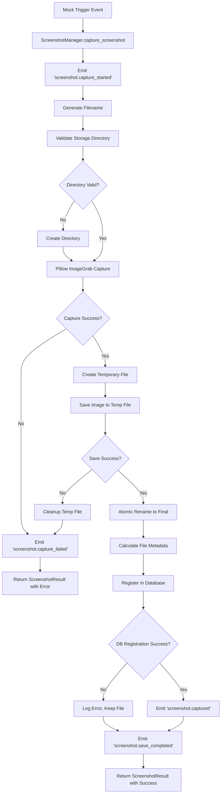
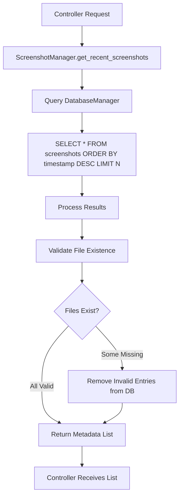

# Step 5: Screenshot Functionality Development - Implementation Plan

## Overview

This document provides a detailed implementation plan for developing the core screenshot functionality in the lightweight, cross-platform desktop application. The implementation focuses on the ScreenshotManager module within the MVC architecture, utilizing asyncio for non-blocking operations and integrating seamlessly with the EventBus pattern.

## 1. ScreenshotManager Module Architecture

### 1.1 Core Responsibilities

The ScreenshotManager serves as the central hub for all screenshot-related operations within the Model layer:

- **Capture Orchestration**: Coordinate screen capture operations using Pillow's ImageGrab functionality
- **File Management**: Handle atomic file operations for screenshot storage with corruption prevention
- **Metadata Registration**: Interface with DatabaseManager for persistent storage of screenshot metadata
- **Directory Management**: Manage screenshot storage directories with dynamic configuration support
- **Event Broadcasting**: Emit events through EventBus for loose coupling with other components
- **Performance Optimization**: Maintain responsive operations through asynchronous processing

### 1.2 Public Interface Design

```
ScreenshotManager Public Interface:

Async Methods:
- async initialize() -> None
- async capture_screenshot(region: Optional[Tuple[int, int, int, int]] = None) -> ScreenshotResult
- async get_recent_screenshots(limit: int = 3) -> List[ScreenshotMetadata]
- async cleanup_old_screenshots(days: int) -> int
- async refresh_directory_config() -> None
- async shutdown() -> None

Sync Methods:
- validate_directory(path: str) -> ValidationResult
- generate_filename(base_name: str = "screenshot") -> str
- get_storage_statistics() -> StorageStats

Properties:
- current_directory: str
- is_initialized: bool
- capture_count: int

Events Emitted:
- "screenshot.capture_started" -> {timestamp: datetime, region: Optional[tuple]}
- "screenshot.captured" -> {metadata: ScreenshotMetadata, file_size: int}
- "screenshot.save_completed" -> {path: str, metadata: ScreenshotMetadata}
- "screenshot.capture_failed" -> {error: str, error_type: str, timestamp: datetime}
- "screenshot.directory_changed" -> {old_path: str, new_path: str}
```

### 1.3 Data Structures

```
ScreenshotMetadata:
- id: Optional[int]  # Database ID after registration
- filename: str
- full_path: str
- timestamp: datetime
- file_size: int
- resolution: Tuple[int, int]
- format: str  # "PNG"
- checksum: str  # SHA256 for integrity verification

ScreenshotResult:
- success: bool
- metadata: Optional[ScreenshotMetadata]
- error_message: Optional[str]
- capture_duration: float
- save_duration: float

ValidationResult:
- is_valid: bool
- error_messages: List[str]
- can_write: bool
- available_space: int

StorageStats:
- total_screenshots: int
- total_size_bytes: int
- oldest_screenshot: Optional[datetime]
- newest_screenshot: Optional[datetime]
- directory_size: int
```

### 1.4 Dependency Injection

The ScreenshotManager follows dependency injection principles for loose coupling:

```
Constructor Dependencies:
- database_manager: DatabaseManager
- settings_manager: SettingsManager
- event_bus: EventBus
- logger: logging.Logger

Optional Dependencies:
- image_processor: Optional[ImageProcessor]  # For future enhancements
- compression_handler: Optional[CompressionHandler]  # For optimization
```

## 2. Filename Generation and Save Logic

### 2.1 Filename Generation Strategy

The filename generation employs a multi-tiered approach for uniqueness:

**Primary Strategy**: Timestamp-based naming
- Format: `screenshot_YYYYMMDD_HHMMSS_mmm.png`
- Example: `screenshot_20251012_143022_847.png`
- Includes milliseconds for sub-second uniqueness

**Collision Resolution**: Counter-based fallback
- Format: `screenshot_YYYYMMDD_HHMMSS_mmm_N.png`
- N increments until unique filename found
- Maximum attempts: 1000 (configurable)

**Validation Rules**:
- Filename length under 255 characters (Windows compatibility)
- No special characters that could cause filesystem issues
- Automatic sanitization of invalid characters

### 2.2 Atomic Save Operations

To prevent file corruption during save operations:

**Temporary File Strategy**:
1. Generate temporary filename with `.tmp` extension
2. Save image data to temporary file
3. Verify file integrity (size, format validation)
4. Atomic rename operation to final filename
5. Register metadata in database only after successful save

**Error Recovery**:
- Cleanup temporary files on failure
- Retry mechanism with exponential backoff
- Fallback to alternative directories if primary fails

### 2.3 File Format and Quality

**Primary Format**: PNG (lossless compression)
- Maintains screenshot quality for AI analysis
- Supports transparency for future overlay features
- Widely compatible across platforms

**Compression Settings**:
- PNG compression level: 6 (balance between size and speed)
- No quality loss for accurate AI processing
- Metadata preservation for EXIF data

## 3. Workflow Diagrams

### 3.1 Screenshot Capture Workflow



### 3.2 Recent Screenshots Query Workflow



### 3.3 Module Interaction Diagram (ASCII)

```
┌─────────────────┐    ┌─────────────────┐    ┌─────────────────┐
│   Controller    │    │   EventBus      │    │   Model Layer   │
│   Layer         │    │                 │    │                 │
│                 │    │                 │    │                 │
│ ┌─────────────┐ │    │                 │    │ ┌─────────────┐ │
│ │HotkeyHandler│ │◄──►│                 │◄──►│ │Screenshot   │ │
│ │   (Mock)    │ │    │                 │    │ │Manager      │ │
│ └─────────────┘ │    │                 │    │ └─────────────┘ │
│                 │    │                 │    │        │        │
│ ┌─────────────┐ │    │                 │    │        ▼        │
│ │Main         │ │◄──►│                 │    │ ┌─────────────┐ │
│ │Controller   │ │    │                 │    │ │Database     │ │
│ └─────────────┘ │    │                 │    │ │Manager      │ │
└─────────────────┘    └─────────────────┘    │ └─────────────┘ │
                                              │        │        │
┌─────────────────┐                           │        ▼        │
│   View Layer    │                           │ ┌─────────────┐ │
│                 │                           │ │Settings     │ │
│ ┌─────────────┐ │                           │ │Manager      │ │
│ │TrayManager  │ │◄─────────────────────────►│ └─────────────┘ │
│ │   (Future)  │ │                           └─────────────────┘
│ └─────────────┘ │
└─────────────────┘

Event Flow:
1. Mock hotkey → EventBus → MainController
2. MainController → ScreenshotManager.capture_screenshot()
3. ScreenshotManager → DatabaseManager (async)
4. ScreenshotManager → EventBus (events)
5. EventBus → TrayManager (future notifications)
```

## 4. Directory Configuration and Management

### 4.1 Integration with SettingsManager

**Configuration Structure**:
```
Screenshot Settings:
- screenshot_directory: str (default: %USERPROFILE%\Screenshots)
- filename_format: str (default: "screenshot_%Y%m%d_%H%M%S_%f")
- auto_create_directory: bool (default: True)
- max_screenshots: int (default: 1000, 0 = unlimited)
- cleanup_days: int (default: 30, 0 = never)
- compression_level: int (default: 6, range 0-9)
```

**Dynamic Configuration Updates**:
- Listen for `settings.updated` events via EventBus
- Validate new directory paths before applying
- Migrate existing screenshots on directory change (optional)
- Emit `screenshot.directory_changed` events for UI updates

### 4.2 Default Path Strategy

**Windows Path Resolution**:
1. Primary: `%USERPROFILE%\Pictures\Screenshots`
2. Fallback 1: `%USERPROFILE%\Screenshots`
3. Fallback 2: `%TEMP%\Screenshots` (temporary)
4. Emergency: Application directory (last resort)

**Path Validation**:
- Existence check with automatic creation
- Write permission verification
- Available disk space validation (minimum 100MB)
- Path length validation (Windows 260 character limit)

### 4.3 Directory Lifecycle Management

**Initialization Sequence**:
1. Load directory path from SettingsManager
2. Validate path accessibility and permissions
3. Create directory structure if missing
4. Initialize directory monitoring for external changes
5. Scan existing screenshots for database synchronization

**Maintenance Operations**:
- Periodic cleanup based on age/count limits
- Orphaned file detection and cleanup
- Directory size monitoring and alerts
- Automatic directory repair on corruption detection

## 5. Error Handling Strategies

### 5.1 Exception Classification and Handling

**Capture-Related Errors**:
```
PIL.ImageGrab.grab() Exceptions:
- OSError: Display access denied → Retry with elevated permissions request
- ValueError: Invalid bbox parameters → Validate region parameters
- MemoryError: Insufficient memory → Reduce capture quality/resolution
- WindowsError: Screen locked/unavailable → Queue for retry when unlocked

Handling Strategy:
- Immediate retry (up to 3 attempts)
- Fallback to lower resolution
- User notification via EventBus
- Graceful degradation to cached screenshots
```

**File System Errors**:
```
File Operation Exceptions:
- PermissionError: Insufficient file permissions → Try alternative directory
- FileNotFoundError: Directory deleted externally → Recreate directory
- OSError: Disk full → Cleanup old files, user notification
- ValueError: Invalid filename characters → Sanitize and retry

Recovery Mechanisms:
- Automatic directory recreation
- Emergency fallback paths
- Atomic operation rollback
- User-guided directory selection (mock UI prompt)
```

**Database Integration Errors**:
```
SQLite Exceptions:
- sqlite3.IntegrityError: Duplicate entry → Update existing record
- sqlite3.OperationalError: Database locked → Retry with backoff
- sqlite3.DatabaseError: Corruption → Attempt repair, fallback to memory

Error Isolation:
- Screenshot capture continues despite DB failures
- Metadata stored in temporary file for later recovery
- Database health monitoring and auto-repair
- Fallback to file-based metadata storage
```

### 5.2 Logging Integration

**Structured Logging Format**:
```
Log Entry Structure:
{
    "timestamp": "2025-10-12T14:30:22.847Z",
    "level": "ERROR|WARNING|INFO|DEBUG",
    "module": "ScreenshotManager",
    "operation": "capture_screenshot|save_file|register_metadata",
    "error_type": "PIL.ImageGrab.Error|OSError|sqlite3.Error",
    "error_message": "Detailed error description",
    "context": {
        "filename": "screenshot_20251012_143022_847.png",
        "directory": "C:\\Users\\User\\Screenshots",
        "file_size": 1048576,
        "retry_count": 2
    },
    "performance": {
        "capture_time": 0.045,
        "save_time": 0.123,
        "total_time": 0.168
    }
}
```

**Log Levels and Categories**:
- **ERROR**: Failed operations requiring user attention
- **WARNING**: Degraded functionality, fallback operations
- **INFO**: Successful operations, configuration changes
- **DEBUG**: Detailed operation flow for troubleshooting

### 5.3 User Feedback Mechanisms

**Notification Strategy via EventBus**:
```
Error Events:
- "screenshot.error.critical" → System tray error notification
- "screenshot.error.warning" → Temporary overlay message
- "screenshot.error.storage" → Directory selection prompt

Success Events:
- "screenshot.success" → Brief confirmation (optional)
- "screenshot.saved" → Update recent screenshots counter

Recovery Events:
- "screenshot.retry.scheduled" → Show retry countdown
- "screenshot.fallback.activated" → Explain fallback mode
```

## 6. Performance and Minimalism Optimizations

### 6.1 Capture Time Optimization

**Asynchronous Capture Strategy**:
- Execute Pillow ImageGrab in thread pool to avoid blocking
- Pre-allocate image buffers for consistent memory usage
- Optimize capture region calculations for multi-monitor setups
- Implement capture queue for rapid successive screenshots

**Memory Management**:
- Image objects discarded immediately after save
- Weak references for temporary image processing
- Garbage collection hints after large operations
- Memory pool for frequently allocated objects

### 6.2 File I/O Optimization

**Asynchronous File Operations**:
- Use asyncio.to_thread() for file writes
- Batch file operations when possible
- Implement write-behind caching for metadata
- Stream large images to disk without full memory loading

**Database Optimization**:
- Prepared statements for metadata insertion
- Batch insertions for multiple screenshots
- Connection pooling for concurrent operations
- Lazy loading of screenshot metadata

### 6.3 Windows 10/11 DPI Scaling Compatibility

**High-DPI Awareness**:
- Detect system DPI scaling settings
- Adjust capture coordinates for scaled displays
- Maintain original resolution in saved files
- Scale-aware thumbnail generation for UI

**Multi-Monitor Support**:
- Query monitor configurations dynamically
- Handle mixed DPI environments
- Coordinate system normalization
- Monitor-specific capture optimization

## 7. Extensibility Considerations

### 7.1 Future Enhancement Points

**Area Selection Extension**:
```
Extension Architecture:
- ICaptureProvider interface for capture methods
- FullScreenProvider (current implementation)
- AreaSelectionProvider (future)
- WindowCaptureProvider (future)

Integration Points:
- Region parameter in capture_screenshot() method
- Event-driven selection UI overlay
- Coordinate transformation utilities
- Selection state management
```

**Annotation System**:
```
Annotation Pipeline:
- IAnnotationProcessor interface
- Pre-save annotation hooks
- Metadata embedding in image files
- Annotation history tracking

Event Integration:
- "screenshot.annotation.requested" event
- "screenshot.annotation.completed" event
- Annotation data in ScreenshotMetadata
```

### 7.2 Plugin Architecture Readiness

**Mock Event System Extensions**:
- Plugin registration via EventBus
- Custom capture providers
- Post-processing pipelines
- External storage integrations

**Configuration Extensions**:
- Plugin-specific settings namespaces
- Dynamic configuration schema
- Plugin lifecycle management
- Dependency resolution system

## 8. Mock Implementation Strategy

### 8.1 Trigger Mock System

**Mock HotkeyHandler Integration**:
```
Mock Trigger Events:
- "hotkey.screenshot.fullscreen" → capture_screenshot()
- "hotkey.screenshot.area" → capture_screenshot(region=mock_region)
- "hotkey.screenshot.window" → capture_screenshot(window=mock_window)

Mock Event Scheduling:
- Timer-based triggers for testing
- Simulated user interaction patterns
- Stress testing with rapid triggers
- Error condition simulation
```

### 8.2 UI Integration Mocks

**Mock Feedback System**:
```
UI Mock Events:
- "ui.notification.show" → Mock system tray notification
- "ui.overlay.update" → Mock recent screenshots overlay
- "ui.progress.show" → Mock capture progress indicator

Mock Response Handlers:
- Simulated user confirmations
- Mock directory selection dialogs
- Simulated error acknowledgments
```

### 8.3 Testing Framework Integration

**Mock Data Generation**:
- Synthetic screenshot metadata
- Mock file system operations
- Simulated database responses
- Performance benchmarking data

**Integration Test Scenarios**:
- Capture sequence validation
- Error recovery testing
- Performance regression detection
- Memory leak identification

## 9. Integration Points and Dependencies

### 9.1 DatabaseManager Integration

**Async Interface Requirements**:
```
Required DatabaseManager Methods:
- async create_screenshot(metadata: ScreenshotMetadata) → int
- async get_recent_screenshots(limit: int) → List[ScreenshotMetadata]
- async update_screenshot(id: int, metadata: ScreenshotMetadata) → bool
- async delete_screenshot(id: int) → bool
- async cleanup_old_screenshots(days: int) → int

Transaction Support:
- Atomic metadata registration
- Rollback on save failure
- Batch operations for cleanup
```

### 9.2 SettingsManager Integration

**Configuration Synchronization**:
```
Settings Monitoring:
- Listen for "settings.updated" events
- Validate configuration changes
- Apply runtime configuration updates
- Emit configuration change events

Required Settings:
- screenshot_directory: str
- filename_format: str
- compression_level: int
- auto_cleanup_enabled: bool
- cleanup_threshold_days: int
```

### 9.3 EventBus Integration

**Event Publishing Requirements**:
```
Critical Events:
- screenshot.captured: Success notifications
- screenshot.failed: Error propagation
- screenshot.directory.changed: Configuration updates

Event Subscription:
- settings.updated: Configuration changes
- app.shutdown: Cleanup operations
- storage.low: Disk space warnings
```

## 10. Minimal Dependency Strategy

### 10.1 Core Dependencies

**Primary Dependencies**:
- `Pillow (PIL)`: Screenshot capture and image processing
- `sqlite3`: Built-in database operations (no external dependency)
- `asyncio`: Built-in asynchronous operations
- `pathlib`: Built-in path operations
- `hashlib`: Built-in checksum generation

**Optional Dependencies**:
- `psutil`: System monitoring (disk space, memory) - fallback to platform-specific calls
- `watchdog`: Directory monitoring - fallback to polling

### 10.2 Fallback Strategies

**Pillow Alternatives**:
- Windows: Win32 API calls via ctypes
- Cross-platform: PyQt6 screen capture (if UI layer available)
- Emergency: External tool invocation (screencapture, import)

**Performance Monitoring**:
- Built-in resource.getrusage() for memory tracking
- Platform-specific disk space queries
- Manual timing for performance metrics

## Conclusion

This implementation plan provides a comprehensive foundation for developing the screenshot functionality while maintaining the principles of minimal coupling, asynchronous operation, and extensibility. The ScreenshotManager module serves as a robust, self-contained component that integrates seamlessly with the existing MVC architecture through the EventBus pattern.

The design emphasizes performance optimization, error resilience, and future extensibility while keeping dependencies minimal and operations non-blocking. Mock implementations ensure testability and allow for incremental development without requiring full system integration.

The architectural decisions support the lightweight nature of the application while providing the flexibility needed for future enhancements such as area selection, annotations, and plugin systems.
